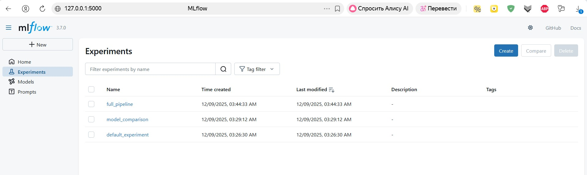
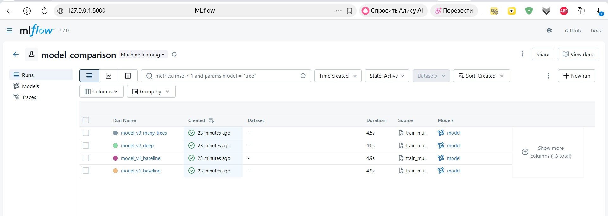

# Отчет о настройке системы версионирования данных и моделей

Реализована полная система версионирования данных и моделей для ML проекта:

| Компонент | Результат |
|-----------|-----------|
| **DVC** | 2 файла данных версионированы (train.csv, test.csv) |
| **MLflow** | 3 эксперимента, 5+ запусков залогировано |
| **Docker** | Подготовлен контейнер |

---

## 1. DVC - Версионирование данных

### Установка и инициализация
```bash
poetry add dvc dvc-s3
poetry run dvc init --no-scm
poetry run dvc remote add -d storage ./dvc_storage
poetry run dvc add data/raw/train.csv data/raw/test.csv
```

**Результат:**
- Созданы `.dvc` файлы с хэшами данных
- Файлы синхронизируются через `./dvc_storage`
- CSV файлы версионируются через Git (.dvc файлы)

---

## 2. MLflow - Логирование моделей и метрик

### Основные возможности

**Логирование в main.py:**
```python
mlflow.log_params(params)           # Параметры модели
mlflow.log_metrics(metrics)         # Метрики (R², MAE, MSE)
mlflow.sklearn.log_model(model, "model")  # Сама модель
mlflow.log_dict(metadata, "metadata.json") # Метаданные
```




### Управление версиями (model_registry.py)

```python
registry = ModelRegistry()

# Сравнение версий
comparison_df = registry.compare_models("housing_price_model")

# Поиск лучшей
best_model = registry.get_best_model("housing_price_model", metric="val_r2")

# Генерация отчета
report = registry.generate_comparison_report("housing_price_model")
```

---

## 3. Воспроизведение

```bash
# Установить зависимости
poetry install

# Получить данные
# Взяты из датасета https://www.kaggle.com/competitions/house-prices-advanced-regression-techniques/data
poetry run dvc pull

# Запустить пайплайн
poetry run python src/itmo_epml/main.py

# Посмотреть результаты
poetry run mlflow ui
```

---

## 4. Структура проекта

```
itmo-epml/
├── src/itmo_epml/
│   ├── main.py             # Обучение с MLflow логированием
│   ├── model_registry.py    # Управление версиями моделей
├── configs/training_config.yaml
├── data/raw/
│   ├── train.csv.dvc        # DVC метаданные
│   ├── test.csv.dvc
│   ├── train.csv            # Версионированы через DVC
│   └── test.csv
├── .dvc/config              # DVC конфигурация
├── Dockerfile               # Production контейнер
├── pyproject.toml           # Зависимости (обновлено)
└── README.md, REPORT1.md, REPORT2.md
```

---

### S3 хранилище (опционально)
```bash
poetry run dvc remote add -d s3storage s3://my-bucket/dvc-storage
```
