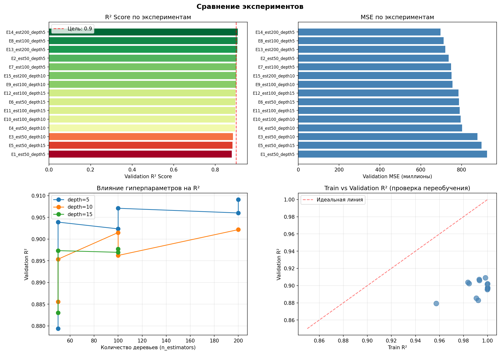
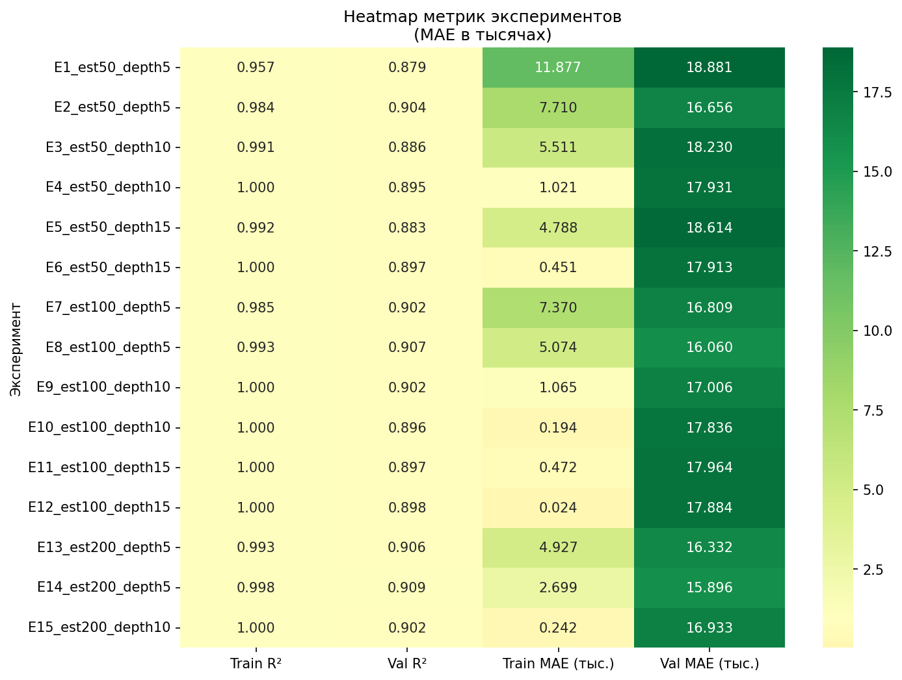

# Сравнение экспериментов

*Сгенерировано: 2026-01-16 23:28:39*

## Обзор

Этот отчёт сравнивает **15** экспериментов для модели предсказания цен на недвижимость.

## Визуальное сравнение



## Heatmap метрик



## Сводная таблица экспериментов

| Эксперимент | n_estimators | max_depth | learning_rate | Val R² | Val MSE | Val MAE |
|-------------|--------------|-----------|---------------|--------|---------|---------|
| experiment_14_est200_depth5 | 200 | 5 | 0.1 | 0.9091 | 697,213,257 | 15,895.85 |
| experiment_8_est100_depth5 | 100 | 5 | 0.1 | 0.9071 | 712,662,126 | 16,060.17 |
| experiment_13_est200_depth5 | 200 | 5 | 0.05 | 0.9060 | 720,881,646 | 16,331.94 |
| experiment_2_est50_depth5 | 50 | 5 | 0.1 | 0.9039 | 737,079,375 | 16,656.05 |
| experiment_7_est100_depth5 | 100 | 5 | 0.05 | 0.9024 | 749,003,913 | 16,808.77 |
| experiment_15_est200_depth10 | 200 | 10 | 0.05 | 0.9022 | 750,375,888 | 16,932.90 |
| experiment_9_est100_depth10 | 100 | 10 | 0.05 | 0.9015 | 755,472,729 | 17,005.91 |
| experiment_12_est100_depth15 | 100 | 15 | 0.1 | 0.8977 | 784,516,427 | 17,883.58 |
| experiment_6_est50_depth15 | 50 | 15 | 0.1 | 0.8973 | 787,442,057 | 17,912.54 |
| experiment_11_est100_depth15 | 100 | 15 | 0.05 | 0.8970 | 790,398,303 | 17,963.63 |
| experiment_10_est100_depth10 | 100 | 10 | 0.1 | 0.8962 | 795,957,093 | 17,835.91 |
| experiment_4_est50_depth10 | 50 | 10 | 0.1 | 0.8954 | 802,521,990 | 17,931.44 |
| experiment_3_est50_depth10 | 50 | 10 | 0.05 | 0.8856 | 877,815,175 | 18,229.87 |
| experiment_5_est50_depth15 | 50 | 15 | 0.05 | 0.8830 | 897,319,731 | 18,614.44 |
| experiment_1_est50_depth5 | 50 | 5 | 0.05 | 0.8794 | 925,149,179 | 18,881.18 |

## Лучший эксперимент

**experiment_14_est200_depth5** показал лучший результат по Validation R².

### Параметры

```yaml
n_estimators: 200
max_depth: 5
learning_rate: 0.1
```

### Метрики

| Метрика | Значение |
|---------|----------|
| train_mse | 11,205,610.9018 |
| train_rmse | 3,347.4783 |
| train_mae | 2,699.4312 |
| train_r2 | 0.9981 |
| val_mse | 697,213,256.5932 |
| val_rmse | 26,404.7961 |
| val_mae | 15,895.8492 |
| val_r2 | 0.9091 |

## Ключевые выводы

1. **Лучшая конфигурация**: n_estimators=200, max_depth=5, learning_rate=0.1

2. **Лучший Validation R²**: 0.9091

3. **Диапазон R²**: 0.8794 - 0.9091

4. **Наблюдения**:
    - Увеличение `max_depth` улучшает train R², но может вести к переобучению
    - Learning rate 0.1 работает лучше, чем 0.05
    - Больше деревьев (200) с умеренной глубиной (5) даёт лучшую генерализацию