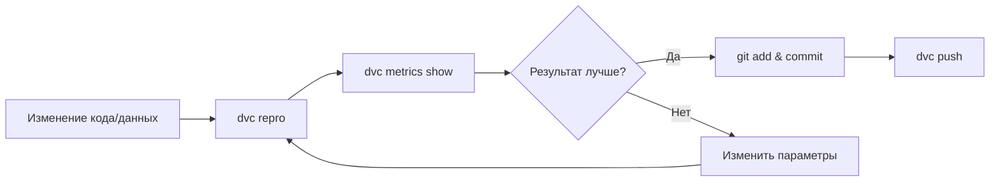

# Быстрый старт

Запустите ML пайплайн за 5 минут.

## Предварительные требования

Убедитесь, что вы выполнили [установку](installation.md).

## Запуск полного пайплайна

### Через DVC

```bash
# Запуск всего пайплайна
dvc repro

# Просмотр метрик
dvc metrics show
```

### Через Python

```bash
# Запуск с мониторингом и уведомлениями
poetry run python src/itmo_epml/main.py
```

## Просмотр результатов

### MLflow UI

```bash
poetry run mlflow ui --backend-store-uri sqlite:///mlflow.db
```

Откройте [http://localhost:5000](http://localhost:5000)

### Метрики в терминале

```bash
# Показать метрики последнего запуска
dvc metrics show

# Показать разницу между запусками
dvc metrics diff
```

## Запуск отдельных стадий

```bash
# Только подготовка данных
dvc repro data_prepare

# Только обучение
dvc repro train

# Принудительный перезапуск
dvc repro -f train
```

## Конфигурация через Hydra

### Изменение модели

```bash
# Random Forest
python -m src.itmo_epml.run_pipeline model=random_forest

# Gradient Boosting
python -m src.itmo_epml.run_pipeline model=gradient_boosting
```

### Изменение параметров

```bash
# Изменение гиперпараметров
python -m src.itmo_epml.run_pipeline model.n_estimators=200 model.max_depth=10
```

### Grid Search

```bash
# Перебор гиперпараметров
python -m src.itmo_epml.stages.train --multirun \
    model.n_estimators=50,100,200 \
    model.max_depth=5,10,20
```

## Использование пресетов экспериментов

```bash
# Baseline эксперимент
python -m src.itmo_epml.run_pipeline experiment=baseline

# Оптимизированный эксперимент
python -m src.itmo_epml.run_pipeline experiment=optimized
```

## ClearML интеграция

```bash
# Локальный запуск с трекингом в ClearML
poetry run python scripts/run_clearml_pipeline.py --mode local

# Grid search через ClearML
poetry run python scripts/run_clearml_pipeline.py --mode grid --experiments 15

# Сравнение экспериментов
poetry run python scripts/compare_experiments.py
```

## Типичный workflow



## Что дальше?

- [Обзор пайплайна](../pipeline/overview.md) — детальное описание стадий
- [Конфигурация](configuration.md) — все параметры Hydra
- [Эксперименты](../experiments/index.md) — результаты экспериментов
