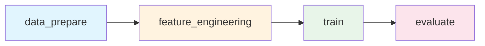

# Обзор ML Pipeline

ML пайплайн состоит из 4 стадий, управляемых DVC.

## Граф пайплайна (DAG)



## Стадии пайплайна

| Стадия | Описание | Входные данные | Выходные данные |
|--------|----------|----------------|-----------------|
| `data_prepare` | Загрузка и очистка данных | `data/raw/*.csv` | `data/interim/*.csv` |
| `feature_engineering` | Создание признаков | `data/interim/*.csv` | `data/processed/*.csv`, `models/scaler.joblib` |
| `train` | Обучение модели | `data/processed/*.csv` | `models/model.joblib` |
| `evaluate` | Оценка модели | `models/model.joblib`, `data/processed/*.csv` | Метрики, графики |

## DVC конфигурация

```yaml title="dvc.yaml"
stages:
  data_prepare:
    cmd: python -m src.itmo_epml.stages.data_prepare
    deps:
      - src/itmo_epml/stages/data_prepare.py
      - data/raw/train.csv
      - data/raw/test.csv
    params:
      - data
    outs:
      - data/interim/train_prepared.csv
      - data/interim/test_prepared.csv
    metrics:
      - reports/metrics/data_stats.json:
          cache: false

  feature_engineering:
    cmd: python -m src.itmo_epml.stages.feature_engineering
    deps:
      - src/itmo_epml/stages/feature_engineering.py
      - data/interim/train_prepared.csv
      - data/interim/test_prepared.csv
    params:
      - data.target_col
      - data.test_size
      - data.random_state
    outs:
      - data/processed/X_train.csv
      - data/processed/X_val.csv
      - data/processed/y_train.csv
      - data/processed/y_val.csv
      - data/processed/X_test.csv
      - models/scaler.joblib
      - models/feature_columns.json

  train:
    cmd: python -m src.itmo_epml.stages.train
    deps:
      - src/itmo_epml/stages/train.py
      - data/processed/X_train.csv
      - data/processed/y_train.csv
      - data/processed/X_val.csv
      - data/processed/y_val.csv
    params:
      - model
      - training
      - mlflow
    outs:
      - models/model.joblib
    metrics:
      - reports/metrics/train_metrics.json:
          cache: false
    plots:
      - reports/figures/feature_importance.json:
          cache: false

  evaluate:
    cmd: python -m src.itmo_epml.stages.evaluate
    deps:
      - src/itmo_epml/stages/evaluate.py
      - models/model.joblib
      - data/processed/X_val.csv
      - data/processed/y_val.csv
    params:
      - mlflow
    metrics:
      - reports/metrics/eval_metrics.json:
          cache: false
    plots:
      - reports/figures/predictions_vs_actual.csv
      - reports/figures/residuals.csv
```

## Команды DVC

### Запуск пайплайна

```bash
# Полный запуск
dvc repro

# Запуск конкретной стадии
dvc repro train

# Принудительный перезапуск
dvc repro -f

# Только одна стадия (без зависимостей)
dvc repro -s train
```

### Просмотр статуса

```bash
# Статус пайплайна
dvc status

# Граф зависимостей
dvc dag

# Метрики
dvc metrics show
dvc metrics diff
```

### Версионирование

```bash
# Добавить данные в DVC
dvc add data/raw/train.csv

# Загрузить данные
dvc pull

# Отправить данные
dvc push
```

## Параметры пайплайна

Параметры определены в `params.yaml`:

```yaml title="params.yaml"
data:
  test_size: 0.2
  random_state: 42
  target_col: SalePrice

model:
  n_estimators: 100
  max_depth: 5
  learning_rate: 0.1
  min_samples_split: 2

training:
  cross_validation: false
  cv_folds: 5

mlflow:
  experiment_name: "House Prices DVC Pipeline"
  model_name: "HousePriceModel"
```

## Метрики и артефакты

### Метрики (JSON)

- `reports/metrics/data_stats.json` — статистика данных
- `reports/metrics/train_metrics.json` — метрики обучения
- `reports/metrics/eval_metrics.json` — метрики оценки

### Графики (plots)

- `reports/figures/feature_importance.json` — важность признаков
- `reports/figures/predictions_vs_actual.csv` — предсказания vs факт
- `reports/figures/residuals.csv` — остатки модели

### Модели

- `models/model.joblib` — обученная модель
- `models/scaler.joblib` — scaler для признаков
- `models/feature_columns.json` — метаданные признаков

## Воспроизводимость

DVC обеспечивает полную воспроизводимость:

1. **Версионирование данных** — каждый запуск использует конкретную версию данных
2. **Фиксация параметров** — параметры сохраняются в `params.yaml` и `dvc.lock`
3. **Кэширование** — промежуточные результаты кэшируются
4. **Git интеграция** — метафайлы DVC хранятся в Git

```bash
# Воспроизвести конкретный эксперимент
git checkout <commit-hash>
dvc checkout
dvc repro
```
