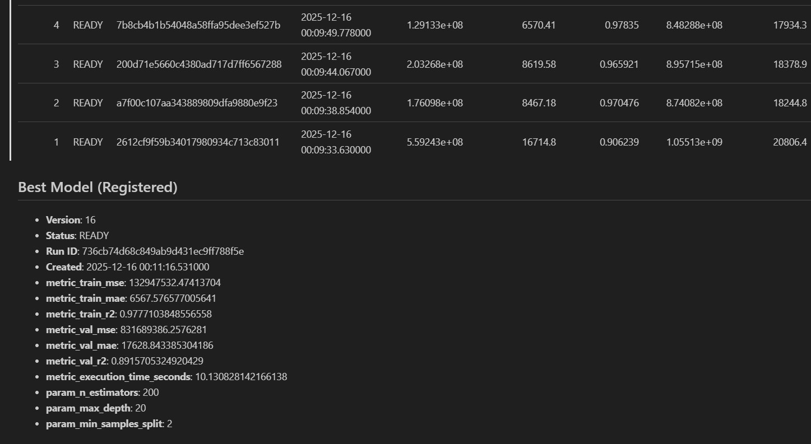
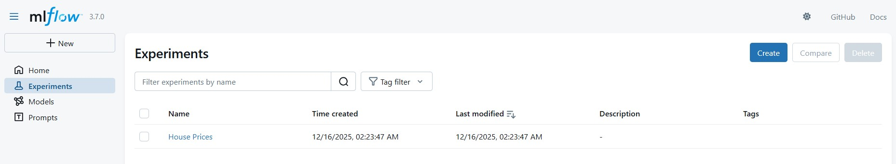
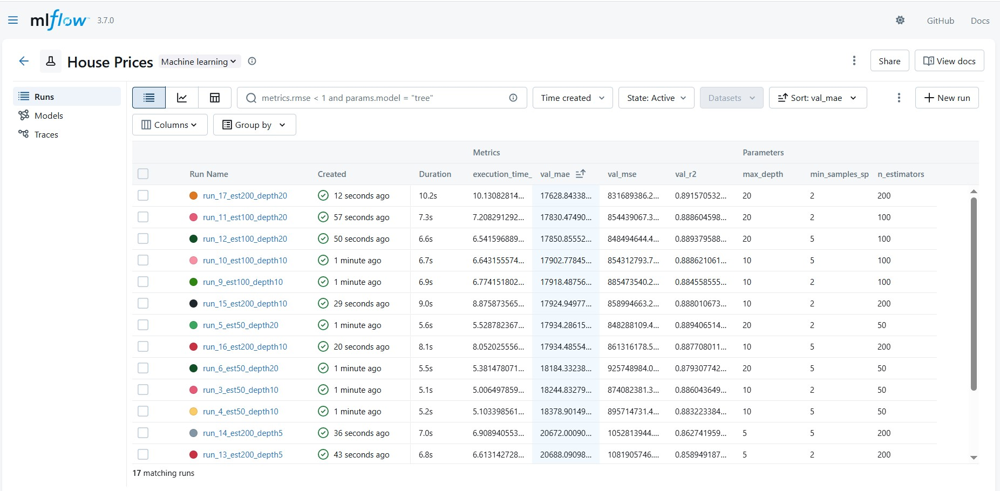
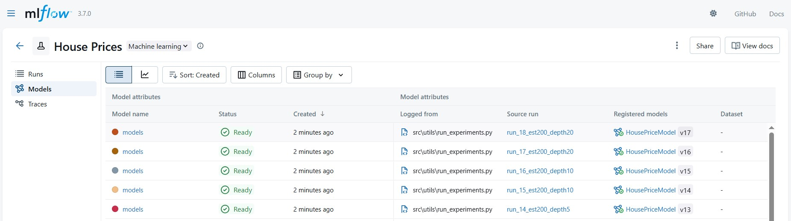
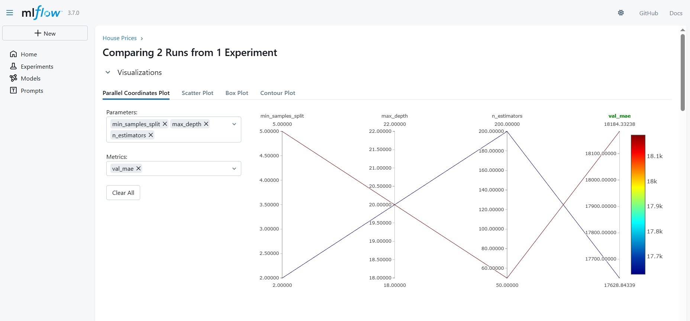

# Отчет о настройке системы версионирования экспериментов (MLflow)

## 1. Настройка инструмента

В качестве основного инструмента для трекинга экспериментов и реестра моделей был выбран **MLflow**.
Устанавливается через `poetry add mlflow`

### Конфигурация
Для повышения надежности хранения метаданных и ускорения поиска экспериментов был выполнен переход с файловой системы на локальную базу данных **SQLite**.

*   **Backend Store URI:** `sqlite:///mlflow.db`
*   **Artifact Root:** `./mlruns` (локальное хранилище артефактов)

Это позволяет использовать SQL-запросы для фильтрации экспериментов и гарантирует целостность данных при параллельных запусках.

### Аутентификация и Доступ
В рамках текущей реализации (Local Setup) доступ осуществляется напрямую к файлу базы данных. В производственной среде `tracking_uri` может быть заменен на удаленный сервер (PostgreSQL/MySQL) без изменения кода обучения.

Создать проект и эксперименты - создаются при запуске `main.py` или `run_experiments.py`, названия используются из `training_config.yaml`.

---

## 2. Интеграция с кодом

Для автоматизации рутинных операций был разработан модуль `mlops_utils.py`.

### Реализованные улучшения:

1.  **Декоратор `@autolog_params`**:\
    Автоматически перехватывает аргументы функции обучения и логирует их как параметры MLflow. Это избавляет от необходимости писать `mlflow.log_param` для каждой переменной вручную.
    ```python
    @autolog_params(exclude=["X_train", "y_train", "model"])
    def train_model(model, ...):
        # ...
    ```

2.  **Контекстный менеджер `mlflow_experiment_context`**:\
    Обеспечивает управление жизненным циклом экспериментов.
    *   Автоматически создает и завершает Run.
    *   Замеряет время выполнения (`execution_time_seconds`).
    *   В случае исключения (Exception) помечает статус Run как `FAILED` и логирует текст ошибки.


3. **Утилиты для работы с экспериментами:**\
Был создан python-класс `ModelRegistry` и его методы для следующих задач:\

Управление реестром моделей
- `register_model`: Регистрирует успешный run как новую версию модели в реестре MLflow. Добавляет описание и теги.
- `get_model_versions`: Получает список всех зарегистрированных версий конкретной модели.

Работа с экспериментами
- `list_experiments`: Ищет эксперименты по имени (поддерживает неполное совпадение, SQL-like синтаксис) и выводит их метаданные.
- `list_runs`: Детальный поиск запусков внутри эксперимента. Поддерживает сложную фильтрацию (например, «learning_rate < 0.01») и сортировку.

Аналитика и Сравнение
- `compare_models`: Строит сводную таблицу (DataFrame) всех версий зарегистрированной модели для сравнения их метрик и параметров.
- `compare_experiment_runs`: Анализирует все запуски внутри одного эксперимента, сортирует их по выбранной метрике (например, Accuracy или Loss)
- `get_best_model`: Находит лучшую зарегистрированную версию модели на основе заданной целевой метрики.

Отчетность
- `generate_comparison_report`: Генерирует читаемый Markdown-отчет со сравнением версий и информацией о лучшей модели. Может сохранять отчет в файл.

---

## 3. Проведение экспериментов

Для поиска оптимальных гиперпараметров был написан скрипт автоматизации `run_experiments.py`.

### Дизайн эксперимента
Использовался метод **Grid Search** для алгоритма `RandomForestRegressor`. Было проведено **18 экспериментов**.

**Сетка параметров:**
*   `n_estimators`: [50, 100, 200]
*   `max_depth`: [5, 10, 20]
*   `min_samples_split`: [2, 5]

### Логирование
Для каждого эксперимента сохранялись:
1.  **Параметры:** Гиперпараметры модели и конфигурация данных.
2.  **Метрики:** Train/Val MSE, MAE, R2.
3.  **Артефакты:** Сама модель, конфигурационный файл `config.yaml`, важность признаков `feature_importance.json`.
4.  **Теги:** Тип эксперимента (`grid_search`) и статус.

---

## 4. Результаты и Сравнение моделей

### Сводная таблица экспериментов
Ниже представлен фрагмент сравнения лучших моделей, отсортированных по метрике `val_r2` (коэффициент детерминации на валидации).



### Скриншоты

**1. Окно экспериментов в MLflow UI:**


**2. Окно запусков в MLflow UI:**


**3. Окно моделей в MLflow UI:**


**4. Окно сравнения метрик в MLflow UI:**

