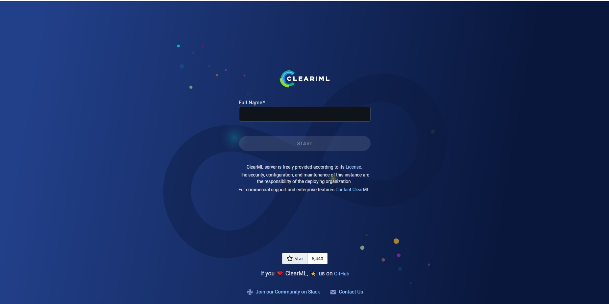
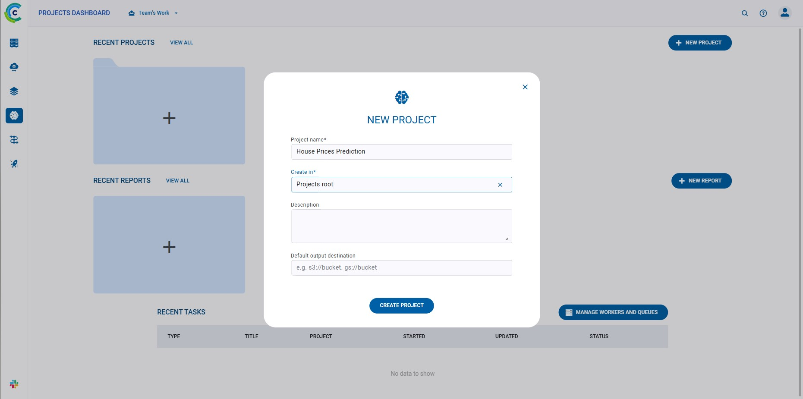
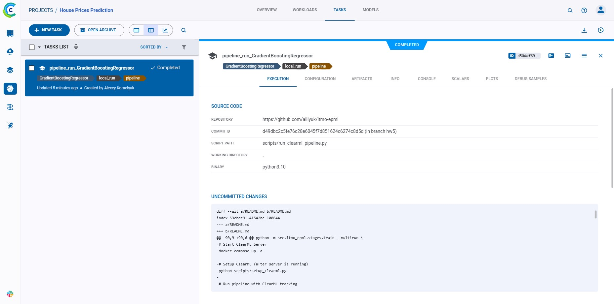
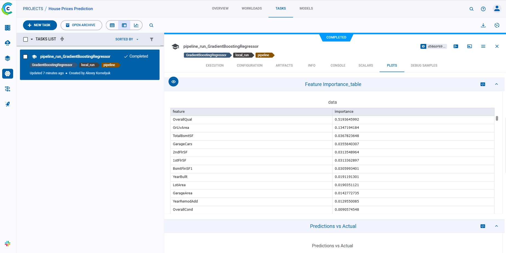
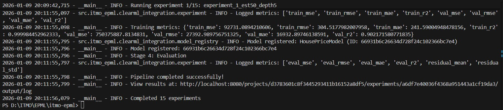
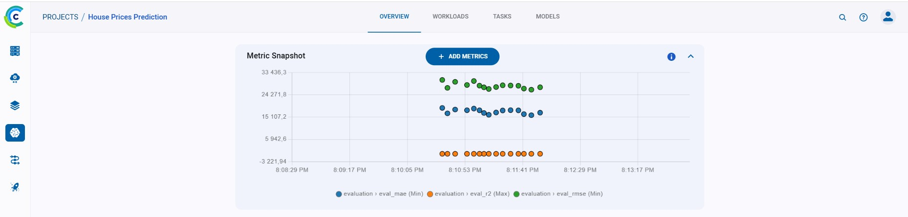
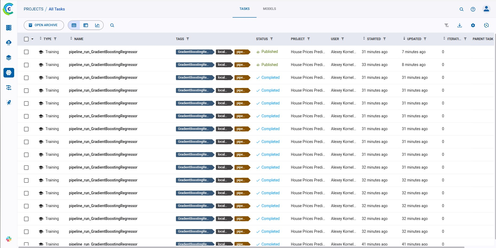
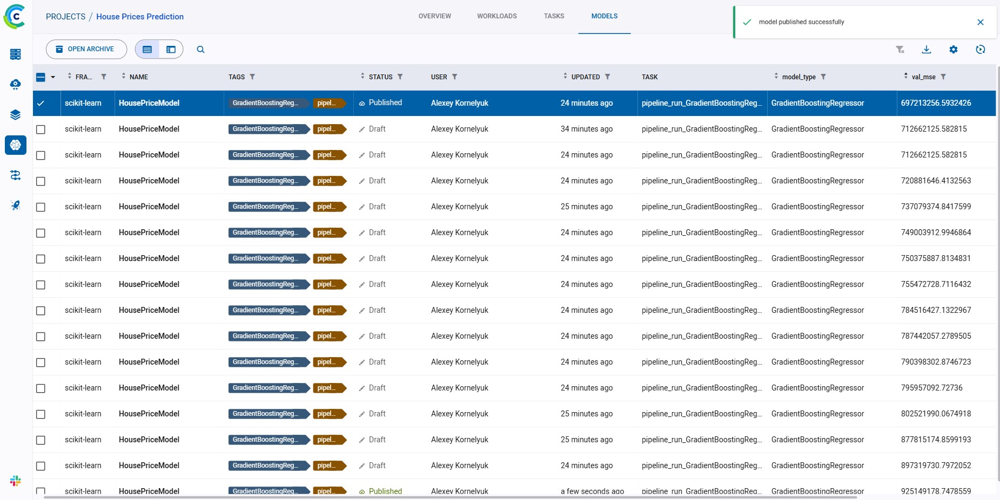
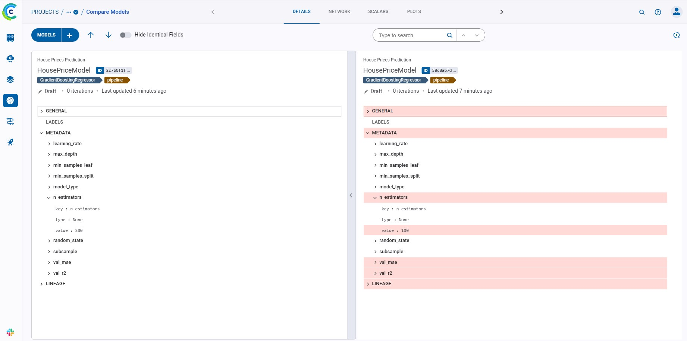
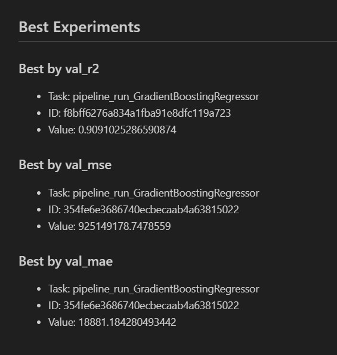

# Отчет о настройке ClearML для MLOps workflow

## 1. Настройка ClearML
### 1.1 Установка ClearML Server
Установка зависимостей:
```bash
poetry add clearml
```

Используется Docker Compose для развертывания ClearML Server:
```bash
docker compose -f docker-compose.clearml.yml up --build -d
```

Переходим по http://localhost:8080. После этого сервис должен запуститься:



Далее создаем credentials: "Settings" -> "Workspace" -> "Create new credentials". Не закрываем эту вкладку с credentials до выполнения следующих двух шагов:

1) Cоздаем файл `.env` в корне проекта (пример: `.env.example`) и туда заносим credentials: `CLEARML_API_ACCESS_KEY` и `CLEARML_API_SECRET_KEY`.

2) Далее запускаем `poetry run clearml-init`. Вставляем туда конфигурационные данные из ClearML. В директории юзера должен появиться `clearml.conf` файл с аналогичными `.env` данными.

Перезапускаем контейнеры:
```bash
docker compose -f docker-compose.clearml.yml down
docker compose -f docker-compose.clearml.yml up -d
```

**Компоненты сервера:**

API Server (порт 8008) - REST API для взаимодействия\
Web Server (порт 8080) - веб-интерфейс\
File Server (порт 8081) - хранилище артефактов\
MongoDB - хранение метаданных экспериментов\
Redis - кэширование и очереди\
Elasticsearch - поиск и индексация\

### 1.2 Настройка базы данных и хранилища
Все данные хранятся в Docker volumes:

clearml-data-mongo - база данных MongoDB\
clearml-data-elastic - индексы Elasticsearch\
clearml-data-fileserver - файлы и артефакты\

### 1.3 Создание проекта
Теперь можно создать проект, например "House Prices Prediction":



Более подробное конфигурирование проекта и экспериментов реализовано в скриптах в `src\itmo_epml\clearml_integration\` и `scripts\`.

### 1.4 Конфигурация клиента
Все параметры конфигурации клиента настроены в `.env` файле, credentials берутся оттуда.

## 2. Трекинг экспериментов
### 2.1 Автоматическое логирование
Класс `ExperimentTracker` обеспечивает:

Автоматическое логирование параметров
Логирование метрик с итерациями
Визуализации (scatter plots, histograms, confusion matrices)
Артефакты и модели

```python
tracker = ExperimentTracker(task)
tracker.log_parameters(config)
tracker.log_metrics({"val_r2": 0.85, "val_mse": 0.015})
tracker.log_feature_importance(features, importances)
```

### 2.2 Система сравнения экспериментов
Класс `ExperimentComparator`:

```python
comparator = ExperimentComparator("House Prices Prediction")
df = comparator.compare_metrics(["val_r2", "val_mse"])
best = comparator.get_best_experiment("val_r2", mode="max")
```

### 2.3 Логирование метрик и параметров
Поддерживаемые типы логирования:

- Скалярные метрики с итерациями
- Конфигурационные параметры
- Feature importance
- Scatter plots (predictions vs actual)
- Histograms (residuals distribution)
- DataFrames как таблицы

### 2.4 Дашборды
ClearML Web UI предоставляет:

- Обзор экспериментов
- Сравнение метрик
- Графики обучения
- История параметров

## 3. Управление моделями
### 3.1 Регистрация и версионирование
```python
registry = ClearMLModelRegistry()
model = registry.register_model(
    model_path="models/model.joblib",
    model_name="HousePriceModel",
    framework="scikit-learn",
    metadata={"val_r2": 0.85}
)
```

### 3.2 Система метаданных
Каждая модель сохраняет:

- Версию и ID
- Framework
- Метрики производительности
- Параметры обучения
- Теги и labels

### 3.3 Автоматическое версионирование
При каждой регистрации создается новая версия:

- Автоматическая нумерация
- Связь с экспериментом
- История изменений

### 3.4 Сравнение моделей
```python
df = registry.compare_models(model_name="HousePriceModel")
best = registry.get_best_model("HousePriceModel", metric="val_r2")
```

## 4. Пайплайны
### 4.1 ClearML Pipeline
Два подхода к созданию пайплайнов:

Декоратор-based:

```python
@PipelineDecorator.pipeline(name="HousePricesPipeline")
def house_prices_pipeline(config):
    data_stats = data_prepare_step(config)
    features = feature_engineering_step(config, data_stats)
    metrics, path = train_step(config, features)
    return evaluate_step(config, metrics, path)
```

Controller-based:

```python
pipeline = ClearMLPipeline(name="HousePricesPipeline")
pipeline.add_step("data_prepare", ...)
pipeline.add_step("train", parents=["data_prepare"], ...)
pipeline.start()
```

### 4.2 Автоматический запуск
```bash
# Локальный запуск с трекингом
poetry run python scripts/run_clearml_pipeline.py --mode local
```




```bash
# Grid search
poetry run python scripts/run_clearml_pipeline.py --mode grid --experiments 15
```






```bash
# Сравнение экспериментов
poetry run python scripts/compare_experiments.py
```




### 4.3 Мониторинг выполнения
Мониторинг реализован в `src\itmo_epml\monitoring.py`:
- Статус каждого этапа
- Время выполнения
- Логи и ошибки
- Артефакты и метрики

### 4.4 Уведомления
Интеграция с системой мониторинга в `src\itmo_epml\notifications.py`:

- Console notifications
- File-based logs
- Возможность добавления Email

### 5. Дополнения в структуре проекта
```text
itmo-epml/
├── configs/
│   └── clearml/
│       └── default.yaml          # ClearML конфигурация
├── src/
│   └── itmo_epml/
│       └── clearml_integration/
│           ├── __init__.py
│           ├── config.py         # Инициализация ClearML
│           ├── experiment.py     # Трекинг экспериментов
│           ├── model_registry.py # Управление моделями
│           └── pipeline.py       # ClearML пайплайны
├── scripts/
│   ├── run_clearml_pipeline.py   # Запуск пайплайна
│   └── compare_experiments.py    # Сравнение
├── docker-compose.clearml.yml            # ClearML Server
└── reports/
    ├── REPORT5.md
    └── metrics/
        ├── clearml_metrics.json
        ├── experiment_comparison.md
        └── model_comparison.md
```
