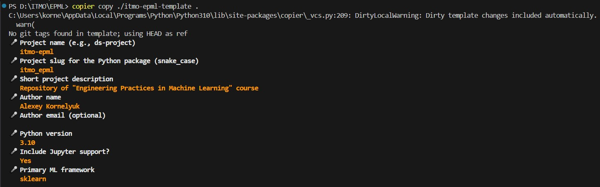
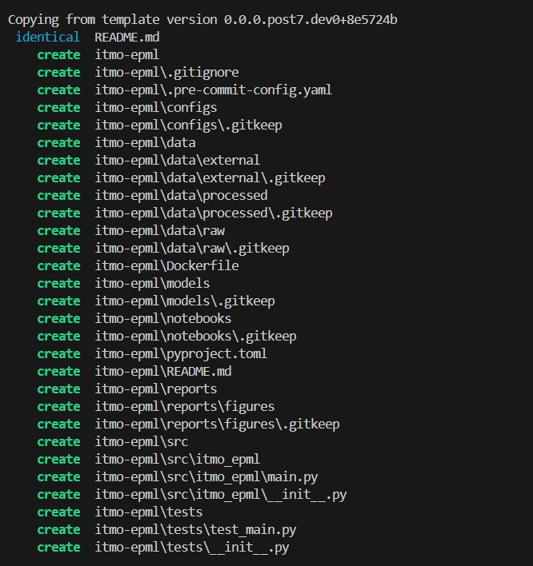
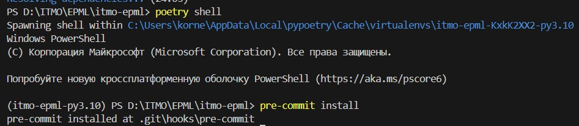
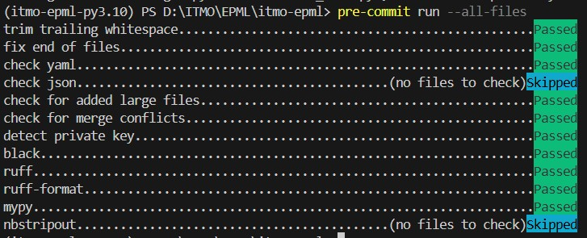
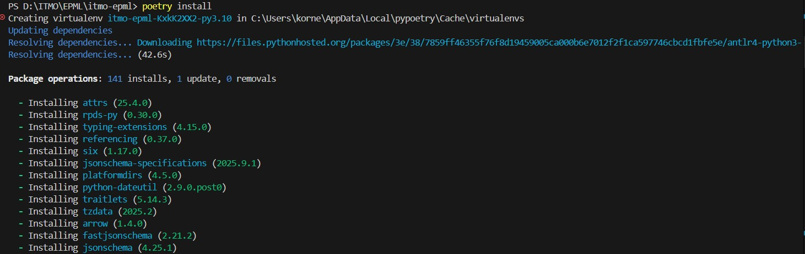
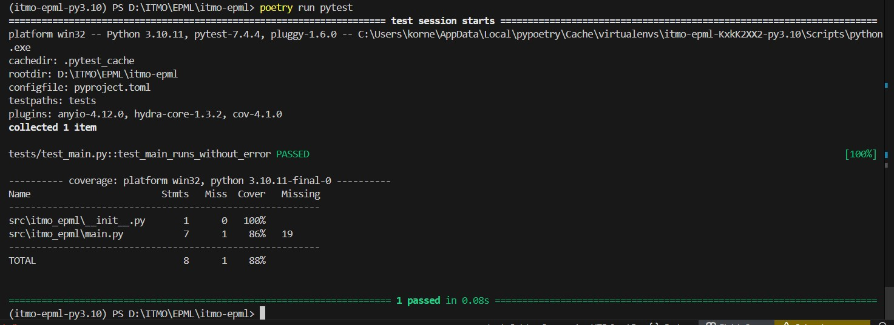

# Отчет о настройке рабочего места Data Scientist

## 0. Предварительная подготовка
Установка необходимых глобальных инструментов:

```bash
pip install copier poetry pre-commit
```

## 1. Структура проекта

### 1.1 Copier Template

Создан шаблон Copier для генерации DS-проектов с параметризацией следующих признаков:
- Название и описание проекта
- Имя и почта автора
- Python версия
- Поддержка Jupyter
- ML фреймворк

Шаблон создан как отдельный репозиторий: [https://github.com/alllyuk/itmo-epml-template](https://github.com/alllyuk/itmo-epml-template)

**Команда генерации:**
```bash
git clone https://github.com/alllyuk/itmo-epml-template
copier copy ./itmo-epml-template/ .
```



### 1.2 Структура папок
Создан `README.md` и вся необходимая структура

```
itmo_epml/
├── src/itmo_epml/        # Исходный код
├── data/                 # Данные (raw, processed, external)
├── notebooks/            # Jupyter notebooks
├── models/               # Обученные модели
├── tests/                # Тесты
├── configs/              # Конфигурации
├── reports/figures/      # Графики и отчеты
├── screenshots/          # Вспомогательные скриншоты
├── .pre-commit-config.yaml
├── pyproject.toml
├── poetry.lock
├── .gitignore
├── Dockerfile
├── REPORT.md
└── README.md
```

## 2. Качество кода

### 2.1 Pre-commit Hooks

Установленные хуки:

- `trailing-whitespace` - удаление пробелов
- `end-of-file-fixer` - пустая строка в конце
- `check-yaml` - валидация YAML
- `check-json` - валидация JSON
- `check-added-large-files` - проверка размера файлов (параметр `maxkb=10000`)
- `check-merge-conflict`- проверка неразрешенных конфликтов
- `detect-private-key` - проверка приватных ключей в файлах
- `black` - форматирование кода
- `ruff` - линтер и форматтер
- `mypy` - проверка типизации
- `bandit` - проверка безопасности (security linter)
- `nbstripout` - очистка Jupyter notebooks

**Установка:**
```bash
poetry install
poetry shell
pre-commit install
```


**Запуск:**
```bash
pre-commit run --all-files
```


### 2.2 Конфигурация инструментов

Все настройки находятся в `pyproject.toml`:

- **Ruff:** `line-length=88`, правила `E, W, F, I, B, C4, UP, ARG, SIM`
- **Black:** `line-length=88`, `target-version=py310`
- **mypy:** strict mode для типизации
- **bandit**: исключены тесты (так как используют assert)

## 3. Управление зависимостями

### 3.1 Poetry

**Установка зависимостей:**
```bash
poetry install
```


**Добавление новой зависимости:**
```bash
poetry add pandas
poetry add --group dev pytest
```

**Проверка тестов**
```bash
poetry run pytest
```


### 3.2 Docker

**Сборка:**
```bash
docker build -t itmo-epml .
```

**Запуск:**
```bash
docker run -it itmo-epml
```

## 4. Git Workflow

### 4.1 Ветки

| Ветка        | Назначение            |
|--------------|---------------------|
| main         | Стабильная версия    |
| develop      | Интеграция фич       |
| feature/*    | Новый функционал     |
| hotfix/*     | Срочные исправления  |
| hwN     | Ветка для ДЗ с номером N  |

### 4.2 .gitignore

Игнорируются:

- Виртуальные окружения (`.venv/`)
- Кэши (`__pycache__/`, `.mypy_cache/`)
- Данные (`data/raw/*`, `data/processed/*`)
- Модели (`*.pkl`, `*.pt`, `*.h5`)
- Секреты (`.env`, `*.pem`)
- IDE настройки (`.idea/`, `.vscode/`)

## 5. Воспроизведение результатов

### Быстрый старт

```bash
# 1. Клонирование
git clone <repo-url>
cd itmo-epml

# 2. Установка зависимостей
poetry install

# 3. Активация окружения
poetry shell

# 4. Установка pre-commit
pre-commit install

# 5. Проверка
pre-commit run --all-files
poetry run pytest
```

### Docker

```bash
docker build -t itmo-epml .
docker run -it itmo-epml
```
