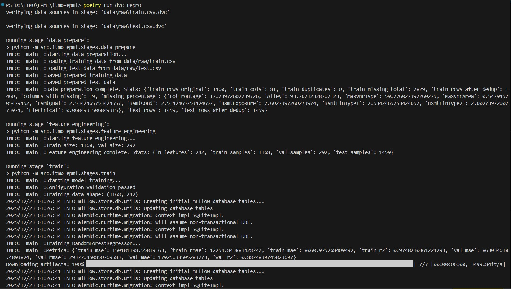
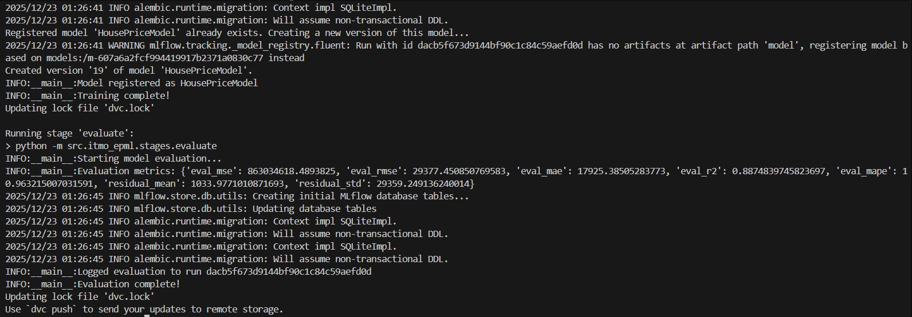
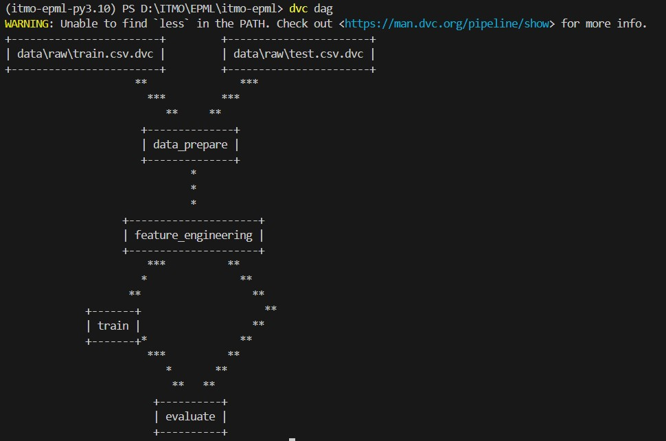
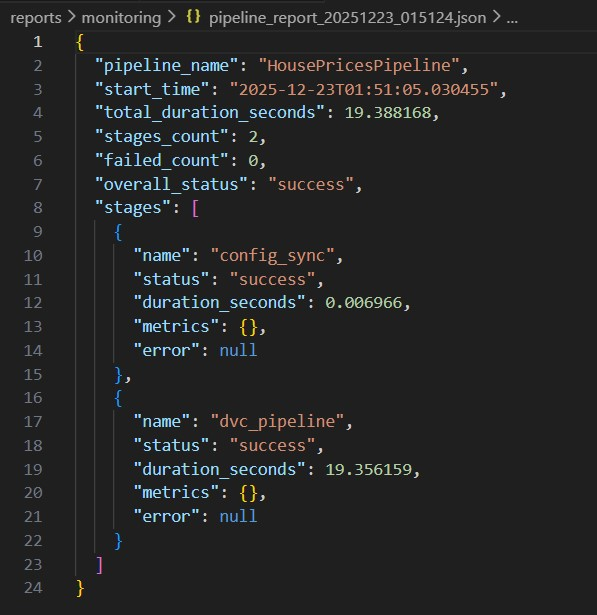

# Отчет о настройке автоматизации ML пайплайнов (DVC + Hydra)

### Команды быстрого старта

```bash
# Установка зависимостей
poetry add hydra-core omegaconf

# Запуск пайплайна
dvc repro

# Запуск с Hydra
python -m src.itmo_epml.run_pipeline

# Эксперимент с другой моделью
python -m src.itmo_epml.run_pipeline model=gradient_boosting

# Grid Search
python -m src.itmo_epml.stages.train --multirun \
    model.n_estimators=50,100,200
```

## 1. Настройка DVC Pipelines

### 1.1 Структура пайплайна

Был создан файл `dvc.yaml` с 4 этапами:

data_prepare → feature_engineering → train → evaluate

### 1.2 Кэширование

DVC автоматически кэширует:
- **Данные:** `data/interim/`, `data/processed/`
- **Модели:** `models/model.joblib`, `models/scaler.joblib`
- **Метрики:** `reports/*.json` (с флагом `cache: false` для версионирования)


## 2. Настройка Hydra
### 2.1 Структура конфигураций
```
configs/
├── config.yaml          # Главный конфиг с defaults
├── data/
│   ├── default.yaml     # Базовые настройки данных
│   └── house_prices.yaml # Специфичные для датасета
├── model/
│   ├── random_forest.yaml
│   ├── linear_regression.yaml
│   └── gradient_boosting.yaml
├── training/
│   └── default.yaml
├── mlflow/
│   └── default.yaml
└── experiment/
    ├── baseline.yaml
    └── optimized.yaml
```

### 2.2 Композиция конфигураций
Hydra позволяет комбинировать конфиги:
```bash
# Использовать Linear Regression вместо Random Forest
python -m src.itmo_epml.stages.train model=linear_regression

# Комбинация: другая модель + оптимизированные параметры
python -m src.itmo_epml.stages.train \
    model=gradient_boosting \
    experiment=optimized
```

### 2.3 Валидация конфигураций
Реализована в train.py:

```python
def validate_config(cfg: DictConfig) -> None:
    """Validate model configuration parameters."""
    if "_validate" in cfg.model:
        for param, rules in cfg.model["_validate"].items():
            value = cfg.model[param]
            if value < rules["min"] or value > rules["max"]:
                raise ValueError(f"Parameter {param} out of range")
```

Пример валидации в random_forest.yaml:

```YAML
_validate:
  n_estimators:
    min: 10
    max: 1000
  max_depth:
    min: 1
    max: 50
```

### 2.4 Multi-run (Grid Search)
```bash
# Запуск grid search через Hydra
python -m src.itmo_epml.stages.train --multirun \
    model.n_estimators=50,100,200 \
    model.max_depth=5,10,20
```

## 3. Интеграция DVC + Hydra
### 3.1 Схема интеграции

```text
Hydra Config → params.yaml → DVC Pipeline → MLflow
     ↓              ↓             ↓            ↓
  config.yaml   Параметры     Выполнение   Трекинг
                 DVC           этапов      метрик
```

### 3.2 Синхронизация конфигураций
Функция update_params_from_hydra() обновляет params.yaml перед запуском DVC:

```python
def update_params_from_hydra(cfg: DictConfig) -> None:
    params = OmegaConf.to_container(cfg, resolve=True)
    params.pop("hydra", None)
    with open("params.yaml", "w") as f:
        yaml.dump(params, f)
```

### 3.3 Единая точка входа
```bash
# Запуск с дефолтной конфигурацией
python -m src.itmo_epml.run_pipeline

# Запуск с переопределением модели
python -m src.itmo_epml.run_pipeline model=gradient_boosting

# Запуск эксперимента
python -m src.itmo_epml.run_pipeline experiment=optimized
```

## 4. Система мониторинга
Класс для отслеживания выполнения этапов:

```Python
monitor = PipelineMonitor(pipeline_name="HousePricesPipeline")

monitor.start_stage("train")
# ... training ...
monitor.end_stage("train", status="success", metrics={"val_r2": 0.85})

monitor.print_summary()
monitor.save_report()
```

## 5. Система уведомлений
Реализована в `src\itmo_epml\notifications.py`.\
Поддерживаемые каналы для уведомлений: Console, File, Email

## 6. Тестирование воспроизводимости
### Запуск тестов

```bash
pytest tests/test_pipeline_reproducibility.py -v
```

### Воспроизводимость через DVC
```bash
# Проверка статуса (что изменилось)
dvc status

# Воспроизведение с теми же параметрами
dvc repro

# Откат к предыдущей версии
git checkout HEAD~1
dvc checkout
```

## 7. Скриншоты результатов

### 7.1 DVC Repro Output




### 7.2 DVC DAG


### 7.3 Monitoring Report
